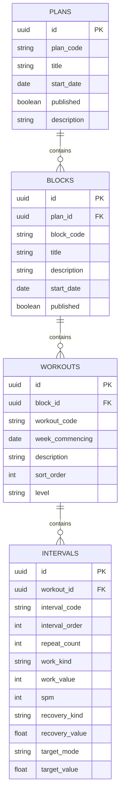

```mermaid
erDiagram
	PLANS {
        uuid id PK
		string plan_code
		string title
		date start_date
		boolean published
		string description
	}
	BLOCKS {
		uuid id PK
        uuid plan_id FK
		string block_code 
		string title
		string description
		date start_date
		boolean published
	}
	WORKOUTS {
        uuid id PK
        uuid block_id FK		
		string workout_code
		date week_commencing
		string description
		int sort_order
		string level
	}
	INTERVALS {
        uuid id PK
        uuid workout_id FK		
		string interval_code
		int interval_order
		int repeat_count
		string work_kind
		int work_value
		int spm
		string recovery_kind
		float recovery_value
		string target_mode
		float target_value
	}
	PLANS ||--o{ BLOCKS : contains
	BLOCKS ||--o{ WORKOUTS : contains
	WORKOUTS ||--o{ INTERVALS : contains
```