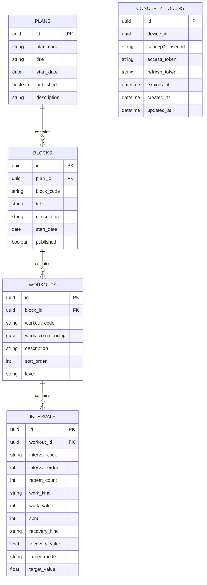

`CONCEPT2_TOKENS` is standalone (no FK to the plan/block/workout hierarchy) — `device_id` is a random identifier issued in a browser cookie when an athlete links their Concept2 account, since the app has no separate login system.