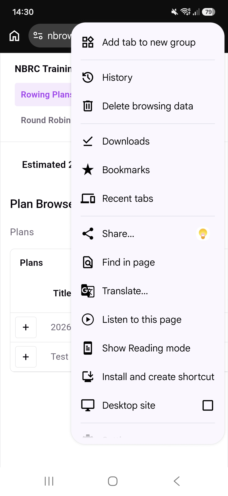
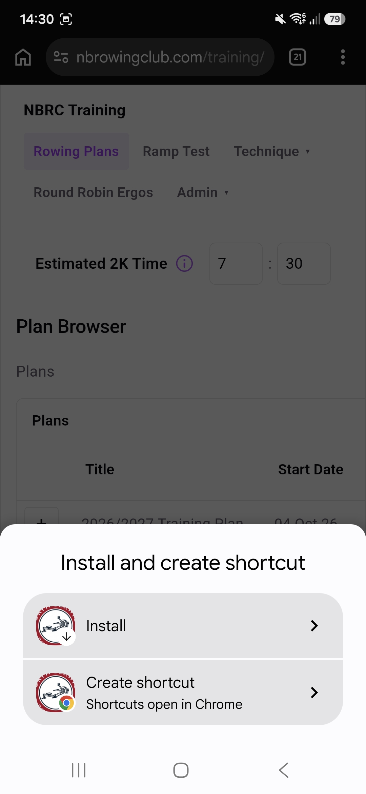
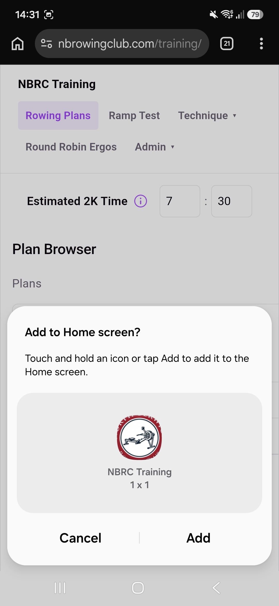

# Install on Android

You can install the NBRC Training app onto your phone. Use the Chrome browser on Android to view this page, then follow these steps

**On an Android phone you will be able to send workouts to the PM5, without needing to program them.**

- Click the three elipisis top right of your Chrome browser  to open the browser menu
- Pick **Install and create shortcut**

<!-- -->

- Select option **Create shortcut / Shortcuts open in Chrome**

<!---->

- Confirm  **Add to Home screen**

<!---->

- You can now open the app from the home screen like a normal installed app.
