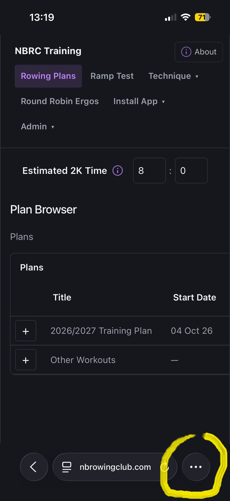
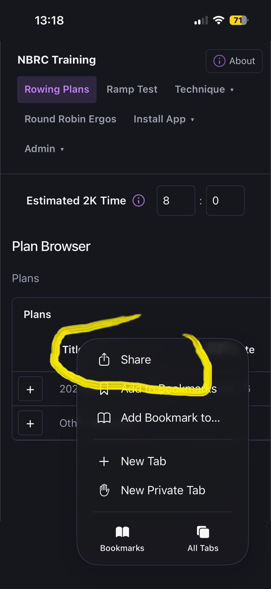
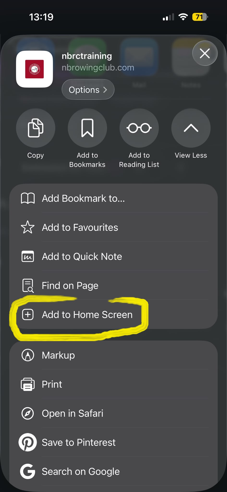
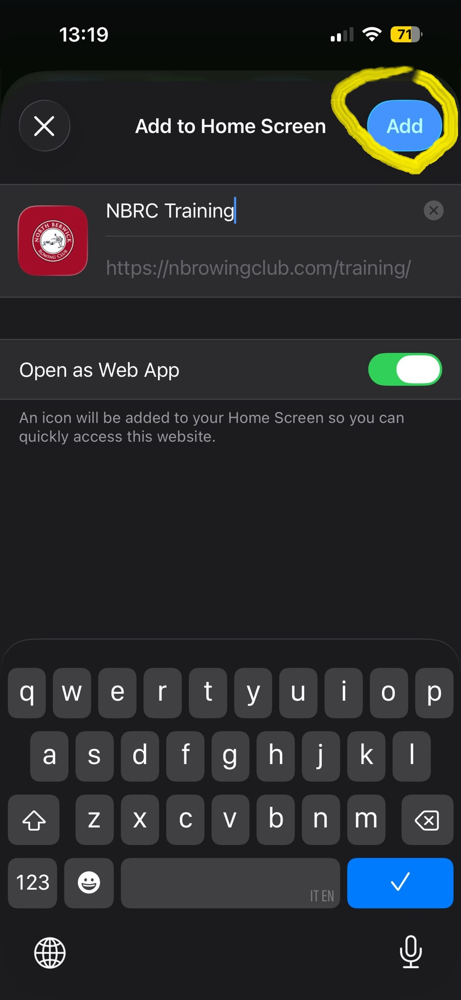

# Install on Apple

## Use Safari to add the app to your home screen for quick access.

Open the NBRC Training site in Safari on your iPhone or iPad.

- Click the three elipisis top right of your Chrome browser  to open the browser menu
- Pick **Install and create shortcut**

- Tap the Share button

- Add to Home Screen

Select **Add to Home Screen** from the menu.

- Tap **Add** and the app will appear on your home screen like a native app.

You can now launch it directly from your home screen without opening Safari each time.
